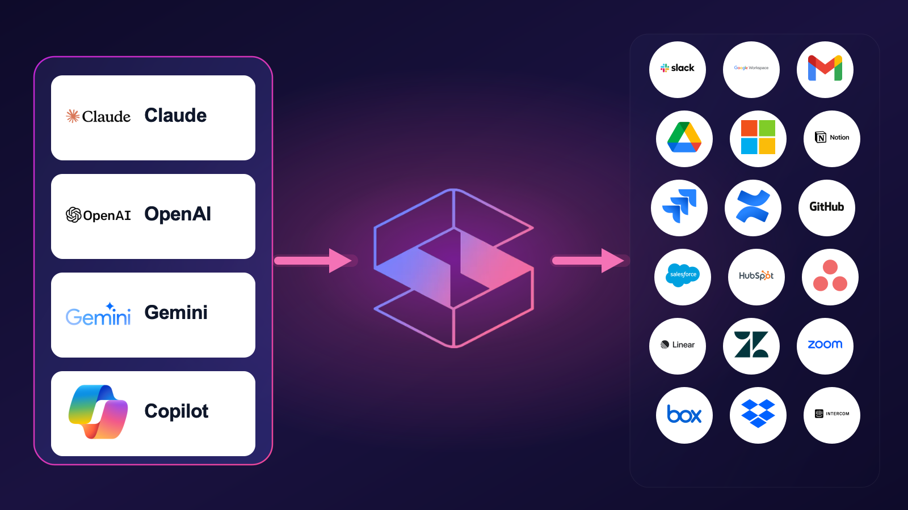
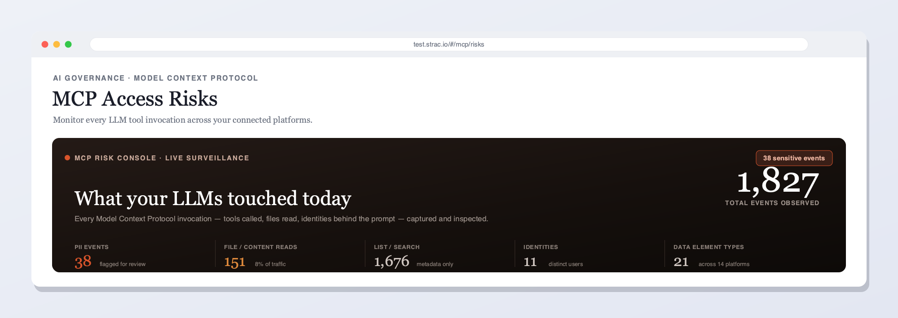

# Strac MCP DLP — PII/PHI/PCI & secret redaction for AI agents (MCP)

An open-source [Model Context Protocol](https://modelcontextprotocol.io) server that gives any AI agent — Claude, Cursor, VS Code, your own — a way to **find and strip sensitive data before it reaches the model.**

[](https://www.strac.io/mcp-integrations)

Point your agent at it, and `redact_text` turns

```
Please onboard the user with SSN 123-45-6789 and email jane@acme.com
```

into

```
Please onboard the user with SSN [REDACTED] and email [REDACTED]
```

...along with a structured list of what was found. It works the same on images, PDFs and scanned documents.

This is a thin client over the [Strac DLP API](https://docs.strac.io). Bring your own API key; all detection and redaction happens server-side at Strac.

---

## Why

Agents are now wired into inboxes, ticketing systems, CRMs, databases and file stores. Every MCP tool call is a chance for an SSN, a card number, a patient record or an AWS key to be pulled into a prompt — and from there into a model provider's logs, a vector store, a Slack summary or a support ticket.

Filtering that data *after* the model has seen it is too late. This server puts the check in front of the model: detect first, redact, then let the agent reason over text that no longer carries the sensitive values.

---

## This server is one door into Strac

Redacting a string you hand it is the smallest thing Strac does. The product is coverage: connect Strac to the SaaS and cloud apps where your sensitive data already lives, and it discovers, classifies, redacts and remediates it *there* — continuously, under your policies, with an audit trail — rather than waiting for someone to paste it into a prompt.

Slack, Google Workspace, Microsoft 365, Salesforce, Zendesk, Box, Dropbox, Jira, Confluence, GitHub, OneDrive, SharePoint, AWS, Azure, GCP, browsers and endpoints — 50+ integrations, agentless, no code to write. Including a full MCP DLP gateway across those connectors, so the data an agent pulls through *any* MCP server is governed the same way.

**[strac.io/mcp-integrations](https://www.strac.io/mcp-integrations)** is that product. This repo is its developer-facing sliver: the same detection engine, reachable from any MCP client, for when you want to sanitise a string or a file yourself.

[](https://www.strac.io/mcp-integrations)

*Every MCP invocation your agents make — tools called, files read, the identity behind the prompt — captured and inspected.*

---

## 60-second quickstart

**1. Install**

```bash
pip install strac-mcp-dlp
```

**2. Request an API key**

[Request a key](https://www.strac.io/book-a-demo), or email [hello@strac.io](mailto:hello@strac.io).

Keys are prefixed `sk_live_` (production) or `sk_test_` (sandbox); the server picks the matching endpoint automatically.

**3. Add it to your MCP client**

Claude Desktop — `~/Library/Application Support/Claude/claude_desktop_config.json` on macOS, `%APPDATA%\Claude\claude_desktop_config.json` on Windows:

```json
{
  "mcpServers": {
    "strac-dlp": {
      "command": "strac-mcp-dlp",
      "env": {
        "STRAC_API_KEY": "sk_live_your_key_here"
      }
    }
  }
}
```

Claude Code:

```bash
claude mcp add strac-dlp --env STRAC_API_KEY=sk_live_your_key_here -- strac-mcp-dlp
```

Cursor — `.cursor/mcp.json` in your project, or `~/.cursor/mcp.json` globally: use the same block as Claude Desktop.

**4. Restart your client and ask it to redact something**

> Use Strac to redact this before I paste it into the ticket: "Customer Jane Doe, SSN 123-45-6789, card 4111 1111 1111 1111."

No install at all, if you have [uv](https://docs.astral.sh/uv/):

```json
{
  "mcpServers": {
    "strac-dlp": {
      "command": "uvx",
      "args": ["strac-mcp-dlp"],
      "env": { "STRAC_API_KEY": "sk_live_your_key_here" }
    }
  }
}
```

See [`examples/`](examples/) for ready-to-copy config files.

---

## Tools

| Tool | What it does | Example |
| --- | --- | --- |
| `redact_text` | Redacts PII/PHI/PCI out of a block of text and returns the sanitised string plus what was found. | `redact_text(text="SSN 123-45-6789")` → `"SSN [REDACTED]"` |
| `detect_sensitive_data` | Scans text and reports which sensitive data types are present, without changing it. | `detect_sensitive_data(text="call me at jane@acme.com")` → `EMAIL` |
| `detect_file` | Scans a local file — image, PDF, scan or text — using Strac's OCR and classifiers. | `detect_file(path="./w2.pdf")` → `TAX_ID_NUMBER, NAME, ADDRESS` |
| `redact_file` | Writes a redacted copy of a local file to disk. The original is never modified. | `redact_file(path="./w2.pdf")` → `./w2.redacted.pdf` |
| `detokenize` | Resolves Strac vault tokens (`tkn_…`) back to their original values, for authorised callers. | `detokenize(token_ids=["tkn_abc"])` → `"111-22-3333"` |

### Redaction styles

`redact_text` takes a `redact_field_mode`:

| Mode | Result |
| --- | --- |
| `REDACTED` (default) | `[REDACTED]` |
| `MASK_SEVEN_X` | `XXXXXXX` |
| `BLANK` | removed entirely |
| `TOKEN_LINK_PLAINTEXT` | `<sensitive_data: https://…/detokenize/tkn_…>` — a link to the value in the Strac vault, so an authorised human can still retrieve it |

### Redaction that doesn't leak

By default these tools return the **types and positions** of what they found, not the values:

```json
{
  "redacted_text": "Please onboard the user with SSN [REDACTED]",
  "detection_count": 1,
  "data_element_types": ["TAX_ID_NUMBER"],
  "detections": [{ "type": "TAX_ID_NUMBER", "begin_index": 33, "end_index": 44, "length": 11 }]
}
```

Returning the matched text alongside the redacted text would hand the model exactly the data you just removed. Pass `include_matched_text=true` when a caller genuinely needs the raw values.

---

## What gets detected

Strac ships **191 built-in data elements across 10 categories**, plus custom elements you define with regex or your own trained model:

| Category | Elements | Examples |
| --- | --- | --- |
| Identification | 126 | SSN/TIN, passports, driver licences and national IDs across ~60 countries — Aadhaar, PAN, PESEL, BSN, Fiscal Code, IRD — plus NPI and DEA registration numbers |
| Secrets | 30 | AWS access and secret keys, GitHub and GitLab tokens, Slack tokens, GCP credentials, Azure storage and service-principal keys, private keys, JDBC and MongoDB connection strings, seed phrases |
| Financial Account | 10 | Card number and tail, CVV, expiry, bank account and routing numbers, IBAN, SWIFT |
| Advertisement Identifiers | 7 | Apple IDFA and IDFV, Google GAID, Roku, Amazon Fire OS, Huawei OAID |
| Contact | 6 | Name, address, email, phone, date of birth, age |
| Device Tracking | 5 | IP address, MAC address, IMEI, webpage URL, date/time |
| Asset | 3 | Source code, VIN, vehicle licence plate |
| Document Properties | 2 | Invoice, password-protected document |
| Content Moderation | 1 | Offensive content |
| Intellectual Property | 1 | Chemical/molecular structure |

Every element named individually: **[Strac Catalog of Sensitive Data Elements](https://www.strac.io/blog/strac-catalog-of-sensitive-data-elements)**.

Detection runs on text and, via OCR, on PDFs, JPEGs, PNGs, DOCX, XLSX, screenshots and `.msg` email files — which is what `detect_file` and `redact_file` reach.

One caveat worth setting expectations on: the `type` values *these MCP tools* return depend on which endpoint answered, and the two use different vocabularies for the same element. A US Social Security Number comes back as `TAX_ID_NUMBER` from `redact_text` and as `SOCIAL_SECURITY_NUMBER` from `detect_sensitive_data` — which additionally reports `SSN` under `reported_element_types`. Both vocabularies are surfaced as returned rather than normalised, so nothing is invented on your behalf. Which elements are detected at all depends on what is enabled for your account; the full catalog above is what runs across your connected apps, where policies, remediation and audit live.

---

## Configuration

| Variable | Required | Default |
| --- | --- | --- |
| `STRAC_API_KEY` | yes | — |
| `STRAC_API_BASE` | no | `https://api.live.tokenidvault.com` for `sk_live_` keys, `https://api.test.tokenidvault.com` for `sk_test_` keys |
| `STRAC_API_TIMEOUT` | no | `60` seconds |

Without a key, every tool returns: `Set STRAC_API_KEY — request one at https://www.strac.io/mcp-integrations`.

The server speaks **stdio** by default. `strac-mcp-dlp --transport streamable-http` serves HTTP instead.

---

## How it works

Your MCP client spawns this server locally; it forwards each tool call to the Strac API over HTTPS with your `X-Api-Key`, and returns the result. Nothing is classified or redacted on your machine, and this repository contains no detection models.

Your data element definitions, custom policies, remediation rules and audit trail live in your Strac account, not in this repo — which is why the same key that powers these five tools also governs every connected app.

```
MCP client  ──stdio──▶  strac-mcp-dlp  ──HTTPS──▶  Strac DLP API
(Claude, Cursor,        (this repo,                 (classifiers, OCR,
 your agent)             ~600 lines)                 vault, policies, audit)
```

Limits inherited from the API: 4 MB for inline content, 10 MB for document uploads, 10 tokens per detokenize call.

---

## Development

```bash
git clone https://github.com/strac-io/strac-mcp-dlp
cd strac-mcp-dlp
python3 -m venv .venv && .venv/bin/pip install -e ".[dev]"
.venv/bin/python -m pytest
```

The test suite mocks the Strac API with `respx`, so it runs without a key. To try the server by hand:

```bash
STRAC_API_KEY=sk_test_… .venv/bin/python -m strac_mcp_dlp
```

Or point the [MCP Inspector](https://github.com/modelcontextprotocol/inspector) at it:

```bash
STRAC_API_KEY=sk_test_… npx @modelcontextprotocol/inspector strac-mcp-dlp
```

---

## Links

- [Strac MCP integrations](https://www.strac.io/mcp-integrations) — the full MCP DLP gateway, connectors, policies and audit
- [Strac catalog of sensitive data elements](https://www.strac.io/blog/strac-catalog-of-sensitive-data-elements) — every data element, named
- [Strac API reference](https://docs.strac.io)
- [MCP DLP: protecting data across Model Context Protocol](https://www.strac.io/blog/mcp-dlp)
- [Strac integrations](https://www.strac.io/integrations) — the full SaaS and cloud connector list

## Security

Never commit an API key. `sk_live_` keys are server-side credentials; keep them in your MCP client's `env` block or your secret manager, not in source control. To report a vulnerability, email [security@strac.io](mailto:security@strac.io).

## License

MIT — see [LICENSE](LICENSE).

<!-- mcp-name: io.github.strac-io/strac-mcp-dlp -->
